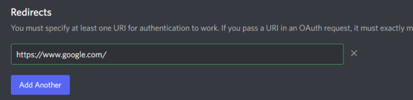
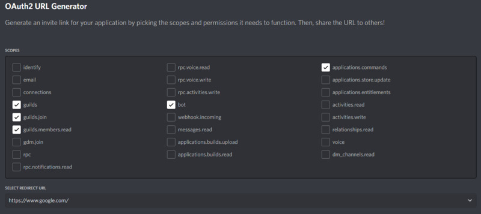
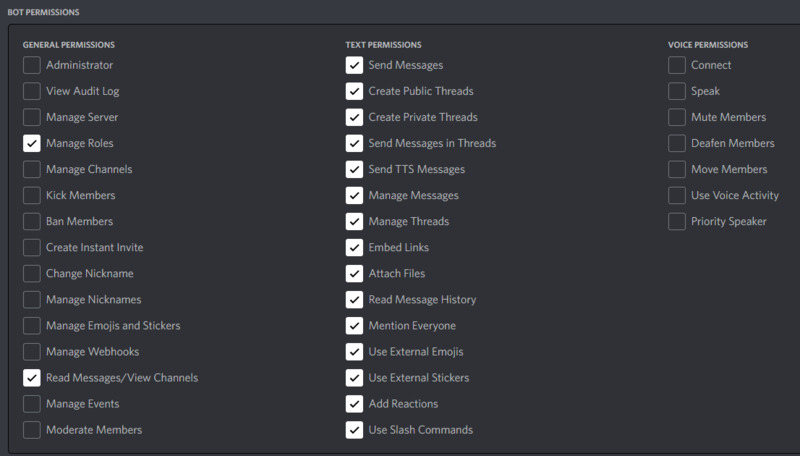

# BroncoderBot

## Description

Setting up and testing...

## Requirements

- Python 3.8+
- Git

## Installation

Need to add the requirements.txt
> git clone https://github.com/misslame/BroncoderBot.git \
> cd BroncoderBot \
> pip install dot-env \
> pip install -U git+https://github.com/Rapptz/discord.py

## Follow any of these guides to setup and invite the bot to the test channel

[Creating a bot account](https://discordpy.readthedocs.io/en/stable/discord.html#discord-intro)

[Creating a bot account 2nd resource](https://discord-py-slash-command.readthedocs.io/en/latest/quickstart.html?highlight=slash#now-let-s-create-our-first-slash-command)

## Execution

Run main file (Windows)
> py main.py

Test your bot in the test server using the */hello* command in the bots channel

## Setup Test Notes

- Create a redirect to any site (google) in OAuth2 > General
- Setup a OAuth2 > URL Generator with SCOPES permissions of: guilds, guilds.join, guilds.members.read, bot, and applications.commands

- In BOT Permissions: Read Messages/View Channels only in General Permissions & select all Text Permissions
-- UPDATE BOTS PERMS

- Copy and paste the generated URL on your browser then select our test server
- Create your .env file and paste your Bot TOKEN (found in the Bot tab) as

> BOT_TOKEN=XYZ

## Discord Bot Reference Guide

[Discord Bot Docs](https://discordpy.readthedocs.io/en/latest/index.html)

## Authors and acknowledgment

...

## Contributing

Pull requests are welcome. For major changes, please open an issue first to discuss what you would like to change.

Please make sure to update tests as appropriate.

## Status and version

In development...

## License

[MIT](./LICENSE)
